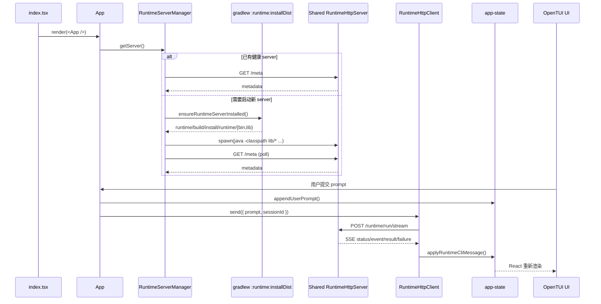

# CLI 模块逻辑关系

本文用于快速理解 `cli` 模块的当前正式主链。这里描述的是 shared local runtime HTTP server + HTTP/SSE 架构；旧的 `protocol.ts`、`runtime-process.ts`、`runtime-cli-host` 方案已经删除，不再作为当前实现说明。

## 模块定位

`cli` 是一个独立的 Bun/OpenTUI 终端界面模块，不属于 Gradle 子模块。它负责：

1. 渲染交互式 TUI
2. 接收用户 prompt 与 `/` 命令
3. 发现或拉起 shared local `RuntimeHttpServer`
4. 用 HTTP + SSE 与 runtime 通信
5. 把 runtime 消息映射为 transcript、状态栏和错误提示

它不负责 provider 探测、capability 实现和 Koog agent 装配。

## 技术栈

- 运行时：Bun
- 语言：TypeScript / TSX
- UI：React 函数组件
- 终端渲染：`@opentui/core` + `@opentui/react`
- 网络：`fetch()` + `ReadableStream`
- 本地宿主管理：`spawn()` / `spawnSync()` / 状态文件

## 总体执行链



## 目录结构

```text
cli/
  package.json
  tsconfig.json
  src/
    index.tsx
    app.tsx
    app-state.ts
    commands.ts
    exit-guard.ts
    layout.ts
    runtime-events.ts
    runtime-http-client.ts
    runtime-request.ts
    runtime-server-manager.ts
    welcome-metadata.ts
    components/
    screens/
    __tests__/
```

## 核心文件

### `src/index.tsx`

真实启动点。

职责：

1. 创建 OpenTUI renderer
2. 创建 React root
3. 把 `App` 挂载到终端

这里不处理 runtime 通信细节，只负责把 UI 启起来。

### `src/app.tsx`

顶层交互组件。

职责：

1. 维护 `AppState`、输入草稿和 Ctrl+C 双击退出状态
2. 在挂载时创建 `RuntimeServerManager` 和 `RuntimeHttpClient`
3. 订阅 runtime 消息与错误
4. 处理普通 prompt 与 `/` 命令提交
5. 在欢迎页和会话页之间切换

关键行为：

1. `useEffect()` 中预热 runtime client
2. `submitPrompt()` 把普通文本转成 `RuntimeRunRequest`
3. runtime 尚未 ready 时追加 system message，而不是静默失败
4. thinking / text / result / failure 都通过 `app-state` 更新 transcript

### `src/app-state.ts`

CLI 的纯状态层。

职责：

1. 定义 `AppState`、`TranscriptEntry` 和命令面板状态
2. 维护 welcome/chat 两个 screen
3. 提供纯函数处理用户输入、副作用结果和 UI 状态转换

关键入口：

1. `createInitialAppState()`：初始化欢迎页、空 transcript 和 runtime 摘要
2. `appendUserPrompt()`：把用户输入写进 transcript，并把 phase 切到 `starting`
3. `appendSystemMessage()`：追加可见系统提示
4. `applyRuntimeCliMessage()`：把 runtime 消息映射为 transcript 与 runtime phase
5. `toggleTranscriptEntryExpanded()`：控制 thinking 区块折叠状态
6. `openCommandPalette()` / `closeCommandPalette()`：维护 `/` 命令面板

其中 `applyRuntimeCliMessage()` 是 UI 与 transport 之间的稳定边界。它不关心底层到底来自哪种 provider 或 capability。

### `src/runtime-request.ts`

定义发送给 runtime 的最小请求结构。

当前重点很小：

1. `RuntimeRunRequest`
2. `createRuntimeRunRequest(prompt, sessionId?)`

provider 解析由 runtime 负责，CLI 只传 prompt 和可选 sessionId。

### `src/runtime-events.ts`

定义 CLI 内部消费的统一 runtime 消息模型。

职责：

1. 定义 `status` / `event` / `result` / `failure` 联合类型
2. 统一 `RuntimeFailureDetails`
3. 提供 `formatRuntimeValue()`，把动态值转成可显示文本

注意：这里的类型是 UI 内部模型，不直接等于原始 SSE 帧。`RuntimeHttpClient` 会先把 SSE 事件规整成这些消息，再交给 `app-state`。

### `src/runtime-server-manager.ts`

shared local server 管理器。

职责：

1. 读取状态文件，尝试复用已有 server
2. 对已有 server 调 `/meta` 做健康检查和协议版本校验
3. 找不到可复用实例时，确保本地 runtime 分发已生成
4. 在需要时用 `java -classpath runtime/build/install/runtime/lib/* com.agent.runtime.server.RuntimeHttpServerKt` 启动新的 shared runtime server
5. 等待 server 健康后，把连接信息写回状态文件

关键类型：

1. `RuntimeServerConnection`
2. `RuntimeServerLaunchSpec`
3. `RuntimeServerManagerOptions`
4. `RuntimeServerMetadata`
5. `RuntimeServerManagerDeps`

关键函数：

1. `getServer()`：对外统一返回当前可用连接
2. `reset()`：清理缓存的解析结果
3. `ensureRuntimeServerInstalled()`：必要时调用 `:runtime:installDist`
4. `createDefaultRuntimeServerManagerOptions()`：生成默认 project root、state file、协议版本等参数

设计重点：

1. server 生命周期不绑定单个 CLI 窗口
2. 本地 token 默认启用
3. 连接复用优先于每次重启 server

### `src/runtime-http-client.ts`

CLI 的 HTTP/SSE 传输层。

职责：

1. 通过 `RuntimeServerLocator` 获取连接信息
2. 向 `/runtime/run/stream` 发送 HTTP 请求
3. 增量消费 SSE body
4. 把 SSE 帧映射成 `RuntimeMessage`
5. 向 UI 层派发消息或错误

关键入口：

1. `start()`：预热 shared local server
2. `send(request)`：发送一次运行请求
3. `onMessage(listener)`：订阅 runtime 消息
4. `onError(listener)`：订阅 transport 层错误
5. `dispose()`：中止活跃流请求
6. `consumeSseStream()`：把 `ReadableStream` 拆成事件帧

当前消费的核心 SSE 事件：

1. `status`
2. `thinking.delta`
3. `text.delta`
4. `run.completed`
5. `run.failed`

### `src/commands.ts`

本地 `/` 命令表与执行逻辑。

职责：

1. 定义默认命令项
2. 执行 `/clear`、`/status`、`/model` 等纯本地动作
3. 生成用户可见状态摘要

这些命令不经过 runtime HTTP server。

### `src/layout.ts`

把欢迎页和会话页布局收敛成可复用的纯函数。

职责：

1. 根据终端高度计算 welcome 布局
2. 根据终端高度计算 chat 布局
3. 在短屏下退化 spacing，保持核心内容可见

### `src/welcome-metadata.ts`

负责欢迎页元信息拼装。

职责：

1. 读取当前 git branch
2. 组装 mode / model / provider 标签
3. 生成 workspace 和版本文案

### `src/screens/*` 与 `src/components/*`

渲染层拆分。

职责：

1. `WelcomeScreen`：欢迎页
2. `ChatScreen`：会话页
3. `TranscriptView`：显示 transcript，包括 thinking 折叠块
4. `Composer` / `CommandPanel` / `Sidebar`：输入与辅助 UI

这些组件不直接接触 runtime transport；它们只消费 `app-state` 已经规整好的数据。

## 测试结构

主要测试职责如下：

1. `runtime-server-manager.test.ts`：server 复用、启动与状态文件
2. `runtime-http-client.test.ts`：HTTP 请求头、SSE 增量消费、事件映射
3. `app-state.test.ts`：thinking/text/result/failure 状态归并
4. `app.test.ts`：提交逻辑
5. 其余组件测试：布局、命令面板、transcript 渲染、welcome metadata

## 关键约束

1. CLI 不直接读取或调用 Kotlin runtime 内部类
2. shared local server 是正式主链；不要再往 `stdio` 方向扩展
3. 所有用户可见状态都应通过 `app-state` 归并，而不是散落在 transport 层
4. `:runtime:installDist` 是 runtime server 分发准备动作，不是旧 `cli host` 流程

## 常用验证命令

```powershell
.\gradlew.bat :runtime:test

Push-Location .\cli
bun test
bun run typecheck
Pop-Location
```
