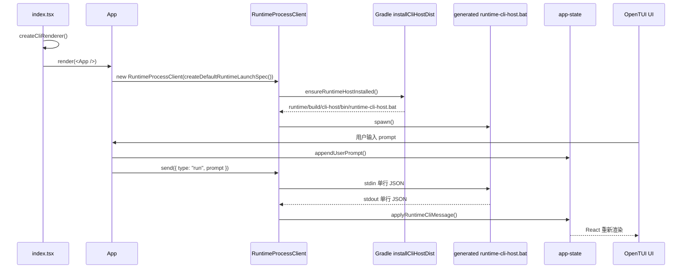
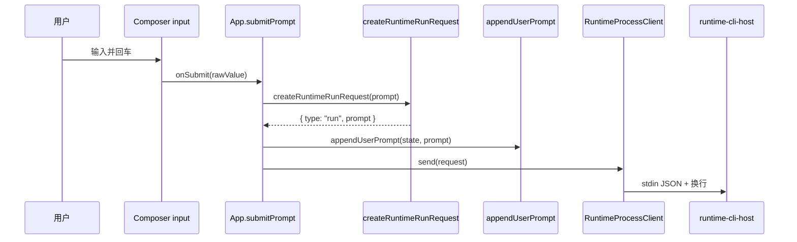
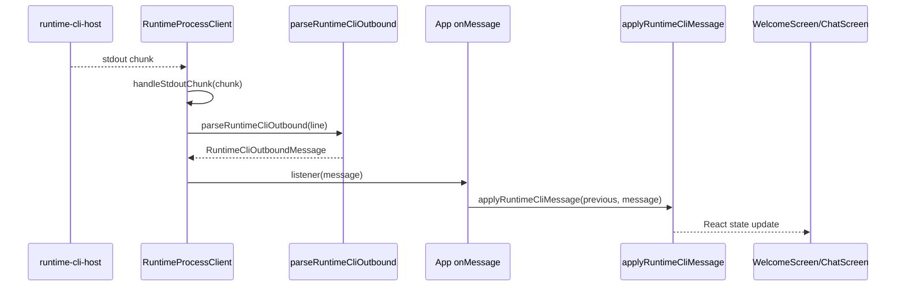
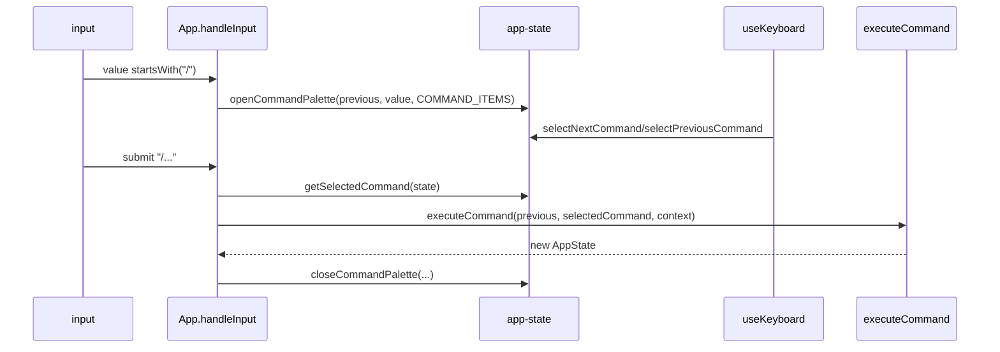
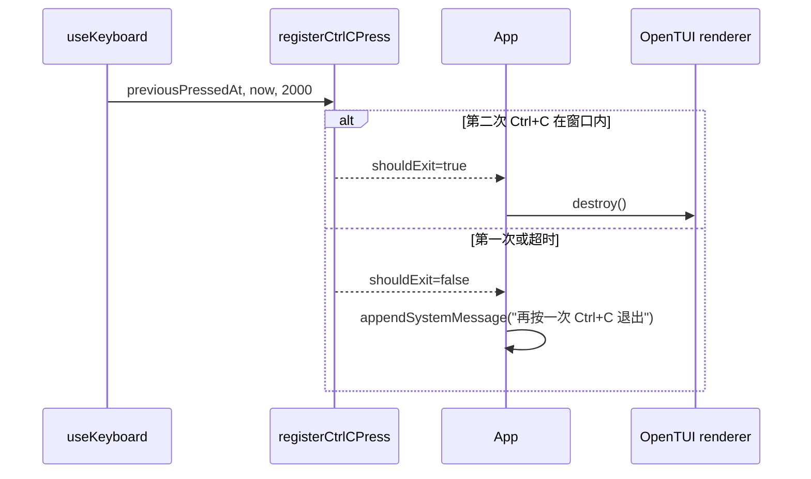

# CLI 模块逻辑关系

本文用于零基础阅读 `cli` 模块。它仿照 `MAIN_LOGIC_RELATIONSHIPS.md` 的写法，先说明技术栈，再按文件解释每个类型、接口、函数、组件和类在系统里的职责。

## 模块定位

`cli` 是一个独立的 Bun/OpenTUI 终端界面模块，不属于 Gradle 子模块。它先运行 `:runtime:installCliHostDist`，由 Gradle 在 `runtime/build/cli-host/bin/runtime-cli-host.bat` 生成 Windows 启动脚本，再通过这个构建产物启动 Kotlin runtime 子进程，然后用 `stdio` 单行 JSON 协议发送 prompt、接收状态、事件、结果和失败消息。

- 运行时：Bun。
- 语言：TypeScript。
- UI：React 函数组件。
- 终端渲染：`@opentui/core` + `@opentui/react`。
- 入口：`cli/src/index.tsx`。
- 主组件：`cli/src/app.tsx`。
- 状态模型：`cli/src/app-state.ts`。
- runtime 协议：`cli/src/protocol.ts`。

## 技术栈入门

- TypeScript
  - 给 JavaScript 加类型系统。
  - `interface` 描述对象结构。
  - `type` 可以描述联合类型，例如 `"welcome" | "chat"`。
  - `unknown` 表示暂时不知道具体类型，比 `any` 更安全。

- React
  - 用函数返回 JSX 来描述界面。
  - `useState` 保存组件内部状态。
  - `useEffect` 处理组件挂载后的副作用，例如启动子进程。
  - `useRef` 保存不会触发重新渲染的可变对象，例如 runtime 客户端实例。

- JSX / TSX
  - `.tsx` 是 TypeScript + JSX。
  - 本项目里的 `<box>`、`<text>`、`<input>`、`<scrollbox>` 不是浏览器 DOM，而是 OpenTUI 提供的终端 UI 元素。

- OpenTUI
  - `createCliRenderer()` 创建终端渲染器。
  - `createRoot(renderer).render(<App />)` 把 React 组件树挂到终端上。
  - `useKeyboard()` 监听键盘。
  - `useTerminalDimensions()` 读取终端宽高。
  - `style` 对象类似 CSS，但服务于终端布局。

- Node/Bun 子进程
  - `spawn()` 启动长期运行的 runtime host。
  - `stdin.write()` 发送请求。
  - `stdout.on("data")` 接收 runtime 输出。
  - `spawnSync()` 同步运行 Gradle 任务，确保 runtime host 分发已生成。

## 总体执行链



## 目录结构

```text
cli/
  package.json
  tsconfig.json
  src/
    index.tsx
    app.tsx
    app-state.ts
    commands.ts
    exit-guard.ts
    layout.ts
    protocol.ts
    runtime-process.ts
    runtime-request.ts
    welcome-metadata.ts
    components/
      CommandPalette.tsx
      Composer.tsx
      Sidebar.tsx
      TranscriptView.tsx
    screens/
      ChatScreen.tsx
      WelcomeScreen.tsx
    __tests__/
```

## package.json

- `name`
  - 当前 npm/Bun 包名：`mulehang-agent-cli`。

- `type: "module"`
  - 使用 ES Module 语法。
  - 因此源码里使用 `import ... from ...`。

- `scripts.dev`
  - `bun run src/index.tsx`。
  - 这是交互式启动入口；按仓库规则，日常验证不要主动启动开发服务器或交互进程。

- `scripts.test`
  - `bun test`。
  - 运行 CLI 单元测试。

- `scripts.typecheck`
  - `bunx tsc --noEmit`。
  - 只做 TypeScript 类型检查，不输出编译产物。

- `dependencies`
  - `@opentui/core`：底层终端渲染器。
  - `@opentui/react`：把 React 组件映射到 OpenTUI。
  - `react`：组件、状态和 hooks。

- `devDependencies`
  - `typescript`：类型检查。
  - `bun-types`：Bun 运行时类型。
  - `@types/react`：React 类型定义。

## src 根文件

### `index.tsx`

- `renderer`
  - 顶层 `const`。
  - 调用 `await createCliRenderer({ exitOnCtrlC: false })` 创建终端 renderer。
  - `exitOnCtrlC: false` 表示 Ctrl+C 不由 OpenTUI 自动退出，而是交给 `App` 自己实现双击退出逻辑。

- `createRoot(renderer).render(<App />)`
  - 创建 React root。
  - 把 `App` 挂载到终端渲染器。
  - 这是整个 CLI UI 的真实启动点。

### `app.tsx`

#### 常量

- `COMMAND_ITEMS`
  - 由 `createCommandItems(DEFAULT_COMMAND_ITEMS)` 生成。
  - 是 `/` 命令面板使用的稳定命令列表。

- `EXIT_WINDOW_MS`
  - Ctrl+C 双击退出窗口。
  - 当前值是 `2_000`，即 2000 毫秒。

#### `App()`

- 顶层 React 函数组件。
- 负责把状态、键盘事件、runtime 子进程、输入框提交和页面选择串起来。

它内部维护的状态：

- `state`
  - 类型是 `AppState`。
  - 保存当前页面、消息流、runtime 摘要状态和命令面板状态。

- `draft`
  - 当前输入框里的文本。

- `lastCtrlCAt`
  - 上一次按 Ctrl+C 的时间戳。
  - 用于判断是否在窗口内连续按了两次。

- `runtimeClientRef`
  - 保存 `RuntimeProcessClient` 实例。
  - 用 `useRef` 是因为子进程客户端本身不是 UI 状态，不需要每次变化都触发渲染。

- `renderer`
  - 来自 `useRenderer()`。
  - 用于在真正退出时调用 `renderer.destroy()`。

- `height`
  - 来自 `useTerminalDimensions()`。
  - 用于响应终端高度变化，选择欢迎页和聊天页布局密度。

- `gitBranch`
  - 首次渲染时读取当前 git 分支。
  - 只读一次，避免每次渲染都执行 git 命令。

主要逻辑：

- `useKeyboard(...)`
  - 监听 Ctrl+C、Escape、上箭头、下箭头。
  - Ctrl+C 调用 `registerCtrlCPress()`。
  - Escape 关闭命令面板。
  - 上下箭头移动命令面板选项。

- `useEffect(...)`
  - 组件挂载后创建并启动 `RuntimeProcessClient`。
  - 注册 runtime 出站消息监听器。
  - 注册 stderr 错误监听器。
  - 组件卸载时取消监听并停止子进程。

- `handleInput(value)`
  - 输入框变化时调用。
  - 更新 `draft`。
  - 如果输入以 `/` 开头，打开并筛选命令面板。
  - 否则关闭命令面板。

- `submitPrompt(rawValue)`
  - 输入框提交时调用。
  - 空输入直接忽略。
  - `/` 开头的输入走本地命令执行。
  - 普通 prompt 会：
    - 构造 runtime 请求。
    - 清空输入框。
    - 把用户 prompt 追加到 transcript。
    - 通过 `runtimeClientRef.current.send(request)` 发送给 runtime。

- `modeLabel` / `agentLabel` / `modelLabel` / `providerLabel`
  - 当前 UI 展示用的固定标签。
  - 目前 provider 和 model 由 runtime 管理，所以显示为 `runtime managed` 和 `runtime default`。

- `welcomeMetadata`
  - 欢迎页底部和输入框元信息。
  - 来自 `createWelcomeMetadata()`。

- `welcomeLayout`
  - 欢迎页布局配置。
  - 来自 `resolveWelcomeLayout(height)`。

- `chatLayout`
  - 聊天页布局配置。
  - 来自 `resolveChatLayout(height)`。

- 返回值
  - `state.screen === "welcome"` 时渲染 `WelcomeScreen`。
  - 否则渲染 `ChatScreen`。

#### `buildStatusLine(state)`

- 导出函数。
- 调用 `formatRuntimeStatus(state.runtime)`。
- 把当前 runtime 摘要压成一行文本。
- 目前可被测试或后续命令逻辑复用。

### `app-state.ts`

#### `AppScreen`

- 字符串联合类型。
- 只能是：
  - `"welcome"`：欢迎页。
  - `"chat"`：会话页。

#### `TranscriptEntry`

- interface。
- 表示消息流里的一条可见消息。

字段：

- `kind`
  - 消息类型。
  - 可选值：`"user"`、`"status"`、`"event"`、`"result"`、`"failure"`、`"system"`。

- `text`
  - 实际显示的文本。

#### `RuntimeSummaryState`

- interface。
- 表示 runtime 子进程当前摘要状态。

字段：

- `phase`
  - 生命周期阶段。
  - 可选值：`"idle"`、`"starting"`、`"running"`、`"completed"`、`"failed"`。

- `mode`
  - 当前运行模式。

- `sessionId`
  - runtime 会话 id，可选。

- `requestId`
  - 当前请求 id，可选。

- `detail`
  - 状态详情，可选。

#### `CommandItem`

- interface。
- 表示 `/` 命令面板中的单个命令。

字段：

- `name`
  - 命令名，例如 `/help`。

- `description`
  - 命令说明。

#### `CommandPaletteState`

- interface。
- 表示命令面板的 UI 状态。

字段：

- `isOpen`
  - 是否打开。

- `query`
  - 当前查询文本。

- `items`
  - 筛选后的命令列表。

- `selectedIndex`
  - 当前高亮项下标。

#### `AppState`

- interface。
- 表示最小 TUI 页面需要维护的全部状态。

字段：

- `screen`
  - 当前页面。

- `transcript`
  - 当前消息流。

- `runtime`
  - runtime 摘要状态。

- `commandPalette`
  - 命令面板状态。

#### `createInitialAppState()`

- 创建初始应用状态。
- 初始页面是 `welcome`。
- 初始消息流为空。
- runtime 初始为：
  - `phase = "idle"`。
  - `mode = "agent"`。
  - `detail = "waiting for input"`。
- 命令面板初始关闭。

#### `createCommandItems(items)`

- 返回 `items.slice()`。
- 作用是复制一份命令数组，避免调用方直接共享原数组引用。

#### `appendUserPrompt(state, prompt)`

- 把用户刚提交的 prompt 追加到 transcript。
- 切换到 `chat` 页面。
- 把 runtime 状态改为：
  - `phase = "starting"`。
  - `detail = "sending prompt"`。

#### `appendSystemMessage(state, text)`

- 追加一条 `kind = "system"` 的系统消息。
- 不改变当前页面。

#### `clearTranscript(state)`

- 清空 transcript。
- 保留其它状态。

#### `openCommandPalette(state, query, allItems)`

- 根据当前输入打开命令面板。
- 会先把 `query` trim 并转小写。
- 如果输入刚好是 `/`，显示所有命令。
- 否则只保留 `item.name` 以输入内容开头的命令。
- 打开后 `selectedIndex` 重置为 0。

#### `closeCommandPalette(state)`

- 关闭命令面板。
- 清空 query 和 items。
- 把 `selectedIndex` 重置为 0。

#### `selectNextCommand(state)`

- 命令面板关闭或没有候选项时，原样返回 state。
- 否则把 `selectedIndex` 下移。
- 使用取模实现循环选择，到末尾后回到第一项。

#### `selectPreviousCommand(state)`

- 命令面板关闭或没有候选项时，原样返回 state。
- 否则把 `selectedIndex` 上移。
- 使用加长度再取模的方式避免负数下标。

#### `getSelectedCommand(state)`

- 返回当前高亮的命令项。
- 命令面板关闭或没有候选项时返回 `undefined`。

#### `applyRuntimeCliMessage(state, message)`

- 把 runtime 发回的协议消息合并到 AppState。

处理分支：

- `status`
  - 切到聊天页。
  - `run.started` 映射为 `phase = "running"`。
  - 其它状态映射为 `phase = "starting"`。
  - 更新 mode、sessionId、requestId、detail。

- `event`
  - 切到聊天页。
  - 更新 sessionId、requestId。
  - 把 `detail` 设置为事件 message。
  - 当前不会向 transcript 追加 event 消息，只更新右侧状态摘要。

- `result`
  - 切到聊天页。
  - 向 transcript 追加 `kind = "result"`。
  - 用 `formatRuntimeCliValue()` 格式化 output。
  - runtime 状态变为 `completed`。

- `failure`
  - 切到聊天页。
  - 向 transcript 追加 `kind = "failure"`。
  - runtime 状态变为 `failed`。

#### `formatRuntimeFailureSummary(kind, message)`

- 私有函数。
- 把失败类型和失败消息压成一行：`${kind}: ${message}`。

### `commands.ts`

#### `CommandExecutionContext`

- interface。
- 表示执行本地 `/` 命令时需要的只读上下文。

字段：

- `modeLabel`
- `agentLabel`
- `modelLabel`
- `providerLabel`

#### `DEFAULT_COMMAND_ITEMS`

- 默认命令列表。

包含：

- `/help`
- `/clear`
- `/agents`
- `/status`
- `/model`

#### `executeCommand(state, commandName, context)`

- 执行本地 `/` 命令。
- 返回新的 `AppState`。

处理分支：

- `/clear`
  - 调用 `clearTranscript(state)`。

- `/help`
  - 切到聊天页。
  - 追加系统消息，列出所有命令。

- `/agents`
  - 追加当前 agent 信息。

- `/status`
  - 调用 `formatRuntimeStatus(state.runtime)`。
  - 追加 runtime 状态摘要。

- `/model`
  - 追加 provider 和 model 信息。

- 默认分支
  - 追加 `Unknown command: ...`。

#### `formatRuntimeStatus(runtime)`

- 把 `RuntimeSummaryState` 压成一行文本。
- 格式包含：
  - `phase`
  - `mode`
  - `session`
  - `request`
  - `detail`
- 缺失值用 `-`。

### `exit-guard.ts`

#### `ExitAttempt`

- interface。
- 表示一次 Ctrl+C 判定结果。

字段：

- `lastPressedAt`
  - 本次按键时间。

- `shouldExit`
  - 是否应该真正退出。

- `message`
  - 应显示给用户的提示。

#### `registerCtrlCPress(previousPressedAt, now, windowMs)`

- 判断是否应该退出。
- 如果上一次 Ctrl+C 存在，并且 `now - previousPressedAt <= windowMs`：
  - 返回 `shouldExit = true`。
  - message 是 `退出中`。
- 否则：
  - 返回 `shouldExit = false`。
  - message 是 `再按一次 Ctrl+C 退出`。

### `layout.ts`

#### `ViewportDensity`

- 字符串联合类型。
- 表示基于终端高度得到的布局密度。

可选值：

- `spacious`
- `compact`
- `minimal`

#### `WelcomeLayout`

- interface。
- 表示欢迎页布局策略。

字段包括：

- `density`
- `showLogo`
- `showTip`
- `horizontalPadding`
- `promptMaxWidth`
- `topSpacerHeight`
- `promptPaddingTop`
- `tipHeight`
- `tipPaddingTop`
- `footerPaddingX`
- `footerPaddingY`

#### `ChatLayout`

- interface。
- 表示聊天页布局策略。

字段包括：

- `density`
- `padding`
- `gap`
- `showHelperText`
- `sidebarMode`

#### `resolveViewportDensity(height)`

- 根据终端高度返回布局密度。

规则：

- `height <= 18`：`minimal`。
- `height <= 26`：`compact`。
- 其它：`spacious`。

#### `resolveWelcomeLayout(height)`

- 先调用 `resolveViewportDensity(height)`。
- 根据密度返回欢迎页具体布局。
- 矮屏时压缩上下留白，必要时隐藏 tip。
- 当前三种密度都保留 logo。

#### `resolveChatLayout(height)`

- 先调用 `resolveViewportDensity(height)`。
- `minimal` 和 `compact`：
  - padding 更小。
  - gap 为 0。
  - 不显示 helper text。
  - 侧栏使用 compact 模式。
- `spacious`：
  - padding 更大。
  - 显示 helper text。
  - 侧栏使用 full 模式。

### `protocol.ts`

#### `RuntimeCliProviderBinding`

- interface。
- 表示 CLI 通过 stdio 传给 runtime 的 provider binding。

字段：

- `providerId`
- `providerType`
- `baseUrl`
- `apiKey`
- `modelId`

#### `RuntimeCliRunRequest`

- interface。
- 表示 CLI 发给 runtime 的运行请求。

字段：

- `type`
  - 固定为 `"run"`。

- `sessionId`
  - 可选会话 id。

- `prompt`
  - 用户输入。

- `provider`
  - 可选 provider binding。

#### `RuntimeCliInboundMessage`

- 类型别名。
- 表示 CLI 发往 runtime 的所有入站消息。
- 当前只有 `RuntimeCliRunRequest`。

#### `RuntimeCliStatusMessage`

- interface。
- 表示 runtime 返回的状态消息。

字段：

- `type = "status"`
- `status`
- `sessionId`
- `requestId`
- `mode`

#### `RuntimeCliEventPayload`

- interface。
- 表示 runtime 事件载荷。

字段：

- `message`
- `payload`

#### `RuntimeCliEventMessage`

- interface。
- 表示 runtime 返回的流式事件消息。

字段：

- `type = "event"`
- `sessionId`
- `requestId`
- `event`

#### `RuntimeCliResultMessage`

- interface。
- 表示 runtime 返回的最终结果消息。

字段：

- `type = "result"`
- `sessionId`
- `requestId`
- `output`
- `mode`

#### `RuntimeCliFailureDetails`

- interface。
- 表示失败详情。

字段：

- `source`
- `providerId`
- `providerType`
- `baseUrl`
- `modelId`
- `apiKeyPresent`

#### `RuntimeCliFailureMessage`

- interface。
- 表示 runtime 返回的结构化失败消息。

字段：

- `type = "failure"`
- `sessionId`
- `requestId`
- `kind`
- `message`
- `details`

#### `RuntimeCliOutboundMessage`

- 联合类型。
- 表示 runtime 发回 CLI 的所有消息。
- 包含：
  - `RuntimeCliStatusMessage`
  - `RuntimeCliEventMessage`
  - `RuntimeCliResultMessage`
  - `RuntimeCliFailureMessage`

#### `serializeRuntimeCliInbound(message)`

- 把入站消息转成 JSON 字符串。
- 给 `RuntimeProcessClient.send()` 写入 stdin 使用。

#### `parseRuntimeCliOutbound(line)`

- 把 runtime stdout 的一行 JSON 解析成对象。
- 校验 `message.type` 是否是：
  - `status`
  - `event`
  - `result`
  - `failure`
- 不支持的类型会抛错。

#### `formatRuntimeCliValue(value)`

- 把动态值转成可展示文本。
- `null` 或 `undefined` 返回空字符串。
- 字符串原样返回。
- 其它值用 `JSON.stringify(value)`。

### `runtime-process.ts`

#### `RuntimeLaunchSpec`

- interface。
- 表示启动 runtime 子进程所需的命令信息。

字段：

- `command`
  - 可执行命令。

- `args`
  - 命令参数。

- `cwd`
  - 子进程工作目录。

#### `RuntimeHostInstallOps`

- 私有 interface。
- 表示安装 runtime host 所需的可替换操作。
- 主要用于测试时注入假实现。

字段：

- `existsSync(path)`
  - 判断生成脚本是否存在。

- `install(projectRoot)`
  - 执行安装任务，返回进程退出码。

#### `RuntimeProcessClient`

- class。
- 负责把 runtime 子进程桥接成可发送请求、接收消息的客户端。

内部字段：

- `messageListeners`
  - 保存 runtime 协议消息监听器。

- `errorListeners`
  - 保存 stderr 或协议解析错误监听器。

- `child`
  - 当前子进程。

- `stdoutBuffer`
  - stdout 分块读取时的缓冲区。
  - 因为 stdout 可能一次收到半行，也可能一次收到多行。

#### `RuntimeProcessClient.constructor(launchSpec)`

- 保存启动配置。
- 不立即启动子进程。

#### `RuntimeProcessClient.start()`

- 异步启动 runtime 子进程。
- 如果已启动，直接返回。
- 使用 `spawn()` 创建子进程。
- 设置 stdout/stderr 编码为 UTF-8。
- stdout 数据进入 `handleStdoutChunk()`。
- stderr 数据派发给 error listeners。
- 等待 `spawn` 事件表示进程已成功创建。
- 如果启动失败，Promise reject。

#### `RuntimeProcessClient.onMessage(listener)`

- 注册 runtime 协议消息监听器。
- 返回一个取消注册函数。

#### `RuntimeProcessClient.onError(listener)`

- 注册错误监听器。
- 返回一个取消注册函数。

#### `RuntimeProcessClient.send(message)`

- 发送一条 runtime 入站消息。
- 如果子进程没启动或 stdin 不可写，抛出错误。
- 会调用 `serializeRuntimeCliInbound(message)`，并追加换行。
- 换行是 stdio 单行 JSON 协议的消息分隔符。

#### `RuntimeProcessClient.dispose()`

- 停止子进程。
- 清空 `child`。
- 清空 stdout 缓冲区。

#### `RuntimeProcessClient.handleStdoutChunk(chunk)`

- 私有方法。
- 把 stdout 文本块追加到 `stdoutBuffer`。
- 循环寻找换行符。
- 每找到一行：
  - trim。
  - 空行跳过。
  - 不是 JSON 对象开头的行跳过。
  - 调用 `parseRuntimeCliOutbound(line)` 解析。
  - 解析成功派发给 message listeners。
  - 解析失败派发给 error listeners。

#### `looksLikeProtocolMessage(line)`

- 私有函数。
- 当前规则很简单：只要以 `{` 开头，就认为可能是协议 JSON。
- 用于过滤 runtime stdout 中非协议日志。

#### `resolveProjectRoot()`

- 返回仓库根目录绝对路径。
- 通过 `import.meta.url` 找到当前文件位置。
- 从 `cli/src/runtime-process.ts` 向上两级得到项目根目录。

#### `ensureRuntimeHostInstalled(projectRoot, ops)`

- 确保 runtime CLI host 的本地分发脚本已经生成。
- 目标脚本路径：
  - `runtime/build/cli-host/bin/runtime-cli-host.bat`
  - 这个 `.bat` 不是提交在源码里的脚本，而是 `runtime/build.gradle.kts` 中 `installCliHostDist` 任务的 `doLast` 动态写出的构建产物。
- 调用 `ops.install(projectRoot)`。
- 如果退出码不是 0，或脚本不存在，抛错。
- 成功时返回脚本路径。

#### `defaultRuntimeHostInstallOps`

- 私有常量。
- 真实安装实现。
- `existsSync` 来自 Node `fs`。
- `install(projectRoot)` 使用 `spawnSync()` 执行：
  - `cmd.exe /c gradlew.bat :runtime:installCliHostDist --quiet`
- 这里使用 `process.env.ComSpec ?? "cmd.exe"`，适配 Windows shell。

#### `createDefaultRuntimeLaunchSpec(projectRoot)`

- 生成真实 TUI 会话默认使用的 runtime 启动配置。
- 默认 `projectRoot` 来自 `resolveProjectRoot()`。
- 先调用 `ensureRuntimeHostInstalled(projectRoot)`。
- 返回：
  - `command = process.env.ComSpec ?? "cmd.exe"`
  - `args = ["/c", scriptPath]`
  - `cwd = projectRoot`

### `runtime-request.ts`

#### `createRuntimeRunRequest(prompt)`

- 构造发送给 runtime 的最小运行请求。
- 返回：
  - `type = "run"`
  - `prompt = prompt`
- 当前不传 provider，让 runtime 自己负责 provider 解析。

### `welcome-metadata.ts`

#### `APP_VERSION`

- 当前 CLI 显示版本。
- 值为 `0.1.0`。

#### `WelcomeMetadata`

- interface。
- 表示欢迎页需要展示的全部元信息。

字段：

- `workspaceText`
- `versionText`
- `composerFooterText`
- `composerHelperText`

#### `WelcomeMetadataInput`

- interface。
- 表示构造欢迎页元信息需要的输入。

字段：

- `cwd`
- `homeDir`
- `gitBranch`
- `modeLabel`
- `modelLabel`
- `providerLabel`

#### `buildComposerMetadata(input)`

- 把 mode、model、provider 拆成输入框底部左右两段。
- 返回：
  - `footerText = input.modeLabel`
  - `helperText = "${modelLabel}   ${providerLabel}"`

#### `buildWorkspaceLabel(input)`

- 构造底部工作区标签。
- 如果 cwd 位于 home 目录下，用 `~` 缩写 home 前缀。
- 如果有 git 分支，追加 `:${branch}`。

#### `readCurrentGitBranch(cwd)`

- 调用 `git symbolic-ref HEAD` 读取当前分支引用。
- 成功时调用 `formatGitBranchRef(output)`。
- 不在 git 工作区或 git 不可用时返回 `undefined`。
- 这里吞掉异常，是为了不影响 TUI 启动。

#### `formatGitBranchRef(ref)`

- 把 git ref 格式化为短标签。
- 当前规则是去掉开头的 `refs/`。
- 例如：
  - `refs/heads/main` -> `heads/main`。

#### `createWelcomeMetadata(input)`

- 聚合欢迎页元信息。
- 调用 `buildComposerMetadata(input)`。
- 调用 `buildWorkspaceLabel(...)`。
- 缺省 cwd 使用 `process.cwd()`。
- 缺省 homeDir 使用 `homedir()`。
- 版本号来自 `APP_VERSION`。

#### `isSameOrNestedPath(path, parent)`

- 私有函数。
- 判断 path 是否等于 parent，或位于 parent 目录下。
- 当前按小写字符串做 Windows/终端路径前缀判断。
- 支持 `\` 和 `/` 两种分隔符。

## components 包

### `components/Composer.tsx`

#### `Composer(props)`

- React 函数组件。
- 渲染底部输入框、输入框 footer，以及可选命令面板。

props 字段：

- `draft`
  - 当前输入值。

- `placeholder`
  - 输入为空时显示的占位文本。

- `footerText`
  - 输入框底部左侧文本。

- `helperText`
  - 输入框底部右侧文本。

- `compact`
  - 是否使用紧凑布局。

- `commandPalette`
  - 命令面板状态。

- `onInput`
  - 输入变化回调。

- `onSubmit`
  - 提交回调。

内部逻辑：

- `boxPadding`
  - 紧凑模式为 0，否则为 1。

- `minComposerHeight`
  - 紧凑模式为 2，否则为 3。

- `showFooter`
  - 只要 footerText 或 helperText 有内容，就显示底部信息行。

渲染结构：

- 外层 `<box>` 垂直排列。
- 命令面板打开时渲染 `<CommandPalette />`。
- 输入框容器里渲染：
  - `<input />`
  - 可选 footer 行。

### `components/CommandPalette.tsx`

#### `CommandPalette(props)`

- React 函数组件。
- 在输入框上方显示 `/` 命令候选项。

props 字段：

- `items`
  - 候选命令列表。

- `selectedIndex`
  - 当前高亮下标。

处理逻辑：

- `items.length === 0`
  - 显示 `No matching commands`。

- 有候选项时
  - 对 `items.map(...)` 渲染每一行。
  - 当前行是否选中由 `index === selectedIndex` 决定。
  - 选中行使用蓝色背景。
  - 选中行左侧显示 `›`，未选中显示空格。

### `components/Sidebar.tsx`

#### `Sidebar(props)`

- React 函数组件。
- 渲染会话页右侧状态栏。

props 字段：

- `title`
  - 侧栏顶部标题，通常取第一条用户消息。

- `runtime`
  - runtime 摘要状态。

- `providerLabel`
  - provider 展示文本。

- `modelLabel`
  - model 展示文本。

- `hasProvider`
  - provider 是否已配置。

- `mode`
  - `"full"` 或 `"compact"`。

渲染内容：

- 标题。
- `Context`
  - mode
  - phase
  - full 模式下额外显示 session、request、detail。

- `Provider`
  - Configured/Missing。
  - providerLabel。
  - modelLabel。

- full 模式额外显示：
  - `MCP: CLI host only`
  - `LSP: Not connected`

### `components/TranscriptView.tsx`

#### `TranscriptView(props)`

- React 函数组件。
- 渲染左侧主消息流。

props 字段：

- `entries`
  - transcript 消息列表。

处理逻辑：

- `entries.length === 0`
  - 显示空状态：`Send a prompt to start the conversation.`。

- 有消息时
  - 使用 `<scrollbox stickyScroll stickyStart="bottom">`。
  - 新消息会让滚动位置尽量保持在底部。
  - 用户消息渲染为带背景的块。
  - 非用户消息渲染为普通文本，颜色由 `colorForEntry()` 决定。

#### `prefixForEntry(kind)`

- 私有函数。
- 根据消息类型返回前缀。
- 当前所有类型都返回空字符串。
- 它预留了以后给 status/event/failure 加前缀的扩展点。

#### `colorForEntry(kind)`

- 私有函数。
- 根据消息类型返回颜色。

规则：

- `status`：灰色。
- `event`：蓝色。
- `result`：白色。
- `failure`：红色。
- `system`：黄色。
- `user`：白色。

## screens 包

### `screens/WelcomeScreen.tsx`

#### `WelcomeScreen(props)`

- React 函数组件。
- 渲染欢迎页。

props 字段：

- `draft`
- `commandPalette`
- `onInput`
- `onSubmit`
- `composerFooterText`
- `composerHelperText`
- `workspaceText`
- `versionText`
- `layout`

渲染结构：

- 主区域：
  - 深色背景。
  - 垂直居中布局。
  - 根据 `layout.showLogo` 决定是否显示 ASCII Logo。
  - 使用 `<ascii-font text="MuleHang" font="block" />` 显示标题。
  - 中部渲染 `Composer`。
  - 根据 `layout.showTip` 决定是否显示 `/` 命令提示。

- 底部栏：
  - 左侧显示 `workspaceText`。
  - 右侧显示 `versionText`。

### `screens/ChatScreen.tsx`

#### `ChatScreen(props)`

- React 函数组件。
- 渲染会话页。

props 字段：

- `state`
- `draft`
- `title`
- `providerLabel`
- `modelLabel`
- `hasProvider`
- `footerText`
- `layout`
- `onInput`
- `onSubmit`

渲染结构：

- 外层横向 `<box>`。
- 左侧主区域：
  - `TranscriptView`。
  - 底部 `Composer`。
- 右侧：
  - `Sidebar`。

布局差异：

- 主区域 padding 和 gap 来自 `layout`。
- `Composer.compact` 由 `layout.density !== "spacious"` 决定。
- helper text 只在 `layout.showHelperText` 为 true 时显示。
- `Sidebar.mode` 来自 `layout.sidebarMode`。

## 测试目录

`cli/src/__tests__` 覆盖核心纯函数和组件行为。学习时建议按以下顺序阅读：

1. `protocol.test.ts`
   - 先理解 stdio JSON 协议如何序列化、解析和报错。

2. `app-state.test.ts`
   - 再理解状态如何从初始态变化到会话态。

3. `commands.test.ts`
   - 学习 `/` 命令如何改变状态。

4. `runtime-request.test.ts`
   - 理解发送给 runtime 的最小请求结构。

5. `runtime-process.test.ts`
   - 学习子进程启动、协议行解析和 host 安装路径。

6. `layout.test.ts`
   - 理解终端高度如何影响布局。

7. `welcome-metadata.test.ts`
   - 学习工作区、版本、git 分支显示逻辑。

8. `command-palette.test.tsx`、`transcript-view.test.tsx`
   - 学习 React/OpenTUI 组件如何按 props 渲染。

9. `exit-guard.test.ts`
   - 理解双击 Ctrl+C 退出策略。

## 关键执行链细化

### 输入 prompt 到 runtime



### runtime 消息到 UI



### `/` 命令面板



### Ctrl+C 双击退出



## 学习路线

1. 先读 `protocol.ts`
   - 理解 CLI 和 runtime 交换什么数据。

2. 再读 `app-state.ts`
   - 理解 UI 状态如何被纯函数更新。

3. 再读 `runtime-request.ts` 和 `runtime-process.ts`
   - 理解 prompt 如何变成 stdin JSON，以及 stdout JSON 如何回到 UI。

4. 再读 `commands.ts`、`exit-guard.ts`、`layout.ts`、`welcome-metadata.ts`
   - 理解本地交互、布局和元信息。

5. 再读 `components/*`
   - 理解小组件如何只依赖 props 渲染。

6. 最后读 `screens/*` 和 `app.tsx`
   - 理解页面如何组合，主 App 如何串起状态、输入和 runtime。

## 当前设计上的几个注意点

- CLI 当前直接启动 Gradle 生成的 runtime CLI host 脚本，不走 HTTP server。
- 普通 prompt 发送给 runtime；`/` 命令只在 CLI 本地执行。
- `event` 消息目前只更新 runtime detail，不追加到 transcript。
- provider/model 标签目前是固定展示文本，真实 provider 由 runtime 管理。
- `RuntimeProcessClient` 会过滤不是 `{` 开头的 stdout 行，所以 runtime 普通日志不会进入协议解析。
- `ensureRuntimeHostInstalled()` 每次都会走 Gradle 增量任务，目的是避免复用过期 runtime host 分发。
