# main 源码包、文件、类与方法逻辑关系

本文只覆盖 `src/main/kotlin`，不解释 `src/test`。

## 总体关系

当前主线可以分成两条执行路径：

1. 设计上的 runtime 路由主轴：`RuntimeRequestDispatcher.dispatch()` -> `RuntimeCapabilityRouter.route()` -> `AgentCapabilityRouter.route()` -> `RuntimeAgentExecutor.execute()`。
2. 当前 HTTP 可调用主轴：`POST /runtime/run` -> `DefaultRuntimeHttpService.run()` -> `RuntimeAgentExecutor.execute()` -> `AgentAssembly.assemble()` -> Koog `AIAgent.run()`。

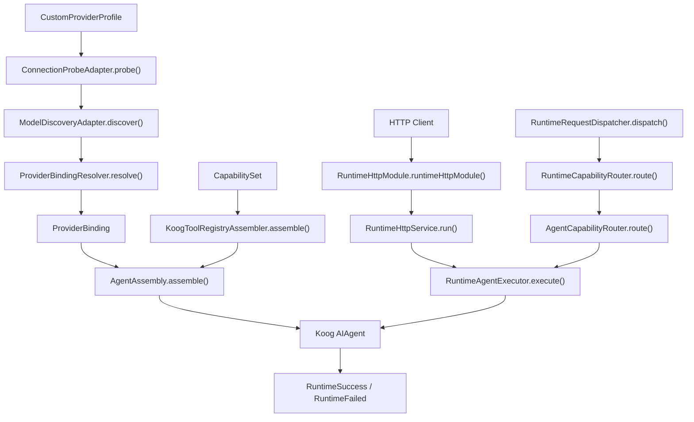

核心依赖方向是：

- `provider` 产出 `ProviderBinding`。
- `capability` 产出 `CapabilitySet`，并能被桥接为 Koog `ToolRegistry`。
- `agent` 消费 `ProviderBinding` 和 `CapabilitySet`，装配并运行 Koog `AIAgent`。
- `runtime` 定义统一请求、上下文、事件、失败、结果和路由边界。
- `server` 把 HTTP 请求翻译到当前 agent 执行链。
- `utils` 提供独立工具函数，目前不直接参与主执行链。

## runtime 包

包路径：`src/main/kotlin/com/agent/runtime`

### UML

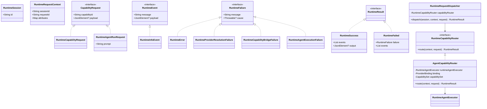

### 文件与逻辑

#### `RuntimeContracts.kt`

- `RuntimeSession`
  - 表示一次 runtime 会话的稳定标识。
  - 被 `RuntimeRequestDispatcher.dispatch()` 用来校验 session，也被 `RuntimeAgentExecutor.execute()` 用于完成事件。

- `RuntimeRequestContext`
  - 表示请求在 runtime 内流转时携带的上下文。
  - `sessionId` 必须和 `RuntimeSession.id` 对齐。
  - `requestId` 用于 agent 执行事件 payload。

- `CapabilityRequest`
  - runtime 交给能力层处理的统一请求接口。
  - 所有具体能力请求都必须提供 `capabilityId` 和可选 `payload`。

- `RuntimeCapabilityRequest`
  - 默认 capability 请求实现。
  - 在 Koog tool bridge 中用于把 Koog tool 调用翻译回仓库内 capability 契约。

- `RuntimeAgentRunRequest`
  - agent 执行专用请求。
  - 默认 `capabilityId` 是 `agent.run`。
  - `AgentCapabilityRouter.route()` 要求 request 必须是这个类型。

- `RuntimeEvent` / `RuntimeInfoEvent`
  - runtime 执行过程中的统一事件。
  - `RuntimeAgentExecutor.execute()` 成功时会产出 `agent.run.started` 和 `agent.run.completed`。

- `RuntimeFailure` 及其实现
  - `RuntimeError`：通用 runtime 错误。
  - `RuntimeProviderResolutionFailure`：provider / binding / executor 解析阶段失败。
  - `RuntimeCapabilityBridgeFailure`：capability 到 Koog tool/MCP 桥接失败。
  - `RuntimeAgentExecutionFailure`：agent 实际执行失败。

- `RuntimeResult` 及其实现
  - `RuntimeSuccess`：成功结果，包含事件和可选输出。
  - `RuntimeFailed`：失败结果，包含分层失败对象和可选事件。

#### `RuntimeCapabilityRouter.kt`

- `RuntimeCapabilityRouter.route(context, request)`
  - runtime 到具体能力实现的抽象边界。
  - 当前 `AgentCapabilityRouter` 是它的具体实现。

#### `RuntimeRequestDispatcher.kt`

- `RuntimeRequestDispatcher`
  - 持有一个 `RuntimeCapabilityRouter`。
  - 职责是把上层入口请求转发到统一 router。

- `dispatch(session, context, request)`
  - 先检查 `session.id == context.sessionId`。
  - 不一致时返回 `RuntimeFailed(RuntimeError)`。
  - 一致时调用 `capabilityRouter.route(context, request)`。

#### `AgentCapabilityRouter.kt`

- `AgentCapabilityRouter`
  - 持有 `RuntimeAgentExecutor`、`ProviderBinding`、`CapabilitySet`。
  - 它把 runtime 里的 `agent.run` 请求连接到 agent 包。

- `route(context, request)`
  - 使用 `require(request is RuntimeAgentRunRequest)` 限制请求类型。
  - 构造 `RuntimeSession(id = context.sessionId)`。
  - 调用 `runtimeAgentExecutor.execute(session, context, request, binding, capabilitySet)`。

## provider 包

包路径：`src/main/kotlin/com/agent/provider`

### UML

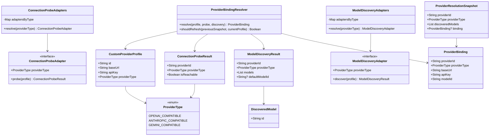

### 文件与逻辑

#### `ProviderType.kt`

- `ProviderType`
  - 表示仓库内 custom provider 支持的兼容协议类型。
  - 当前有 `OPENAI_COMPATIBLE`、`ANTHROPIC_COMPATIBLE`、`GEMINI_COMPATIBLE`。
  - 后续 probe、discovery、binding、Koog executor 解析都以它作为分派依据。

#### `CustomProviderProfile.kt`

- `CustomProviderProfile`
  - 用户维护的 custom provider 配置。
  - `providerType` 默认是 `OPENAI_COMPATIBLE`。
  - 它是 probe、discovery、binding resolver 的输入源。

#### `ConnectionProbe.kt`

- `ConnectionProbeResult`
  - 一次连接探测后的统一结果。
  - `isReachable` 决定 `ProviderBindingResolver.resolve()` 是否允许生成 binding。

- `ConnectionProbeAdapter`
  - 按 provider 类型执行连接探测的适配器接口。
  - `probe(profile)` 接收 `CustomProviderProfile`，返回 `ConnectionProbeResult`。

- `ConnectionProbeAdapters`
  - 构造时把 adapter 列表按 `providerType` 建成 map。
  - `resolve(providerType)` 返回对应探测 adapter。
  - 未注册对应类型时直接 `error()`。

#### `ModelDiscovery.kt`

- `DiscoveredModel`
  - 表示一个远端模型条目。

- `ModelDiscoveryResult`
  - 表示模型发现结果。
  - `defaultModelId` 优先级高于 `models.firstOrNull()`。

- `ModelDiscoveryAdapter`
  - 按 provider 类型执行模型发现的适配器接口。
  - `discover(profile)` 接收 `CustomProviderProfile`，返回 `ModelDiscoveryResult`。

- `ModelDiscoveryAdapters`
  - 构造时把 adapter 列表按 `providerType` 建成 map。
  - `resolve(providerType)` 返回对应模型发现 adapter。
  - 未注册对应类型时直接 `error()`。

#### `ProviderBinding.kt`

- `ProviderBinding`
  - runtime 最终消费的 provider binding。
  - agent 包中的 `KoogExecutorResolver.resolve()` 会把它转成 Koog executor 和 `LLModel`。

- `ProviderResolutionSnapshot`
  - 保存一次 provider 解析后的缓存快照。
  - 用于判断当前 profile 是否需要丢弃旧 discovery/binding。

#### `ProviderBindingResolver.kt`

- `ProviderBindingResolver`
  - 把 profile、probe result、discovery result 合成最终 `ProviderBinding`。

- `resolve(profile, probe, discovery)`
  - 要求 `probe.isReachable == true`。
  - 要求 profile、probe、discovery 三者 `providerId` 一致。
  - 要求三者 `providerType` 一致。
  - 选择模型时优先用 `discovery.defaultModelId`，否则用 `discovery.models.firstOrNull()?.id`。
  - 没有可用模型时 `error()`。
  - 返回包含 baseUrl/apiKey/modelId 的 `ProviderBinding`。

- `shouldRefresh(previousSnapshot, currentProfile)`
  - 当前只判断 `providerType` 是否变化。
  - 类型变化时返回 true，表示旧模型发现结果和 binding 应丢弃。

## capability 包

包路径：`src/main/kotlin/com/agent/capability`

### UML

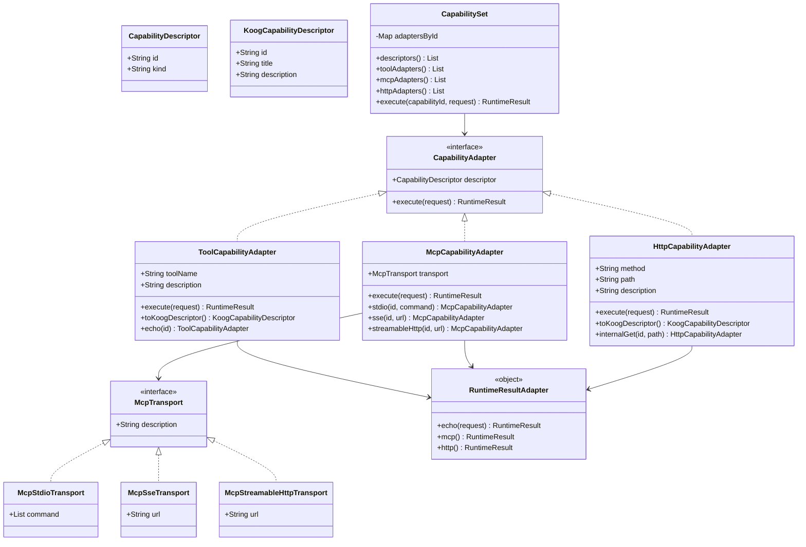

### 文件与逻辑

#### `CapabilityContract.kt`

- `CapabilityAdapter`
  - runtime 可调用能力的统一适配器接口。
  - `execute(request)` 接收 `CapabilityRequest`，返回 `RuntimeResult`。

- `CapabilityDescriptor`
  - 对外暴露的能力描述。
  - `id` 用于能力路由，`kind` 区分 `tool`、`mcp`、`http`。

- `KoogCapabilityDescriptor`
  - 可桥接到 Koog 的最小能力描述。
  - 当前主要由 tool/http adapter 转换时使用。

#### `CapabilitySet.kt`

- `CapabilitySet`
  - 表示当前 runtime 可用的一组能力 adapter。
  - 构造时按 `descriptor.id` 建立 `adaptersById`。

- `descriptors()`
  - 返回所有 adapter 的描述。
  - `AgentAssembly.assemble()` 最终会把这些描述放进 `AssembledAgent.capabilities`。

- `toolAdapters()` / `mcpAdapters()` / `httpAdapters()`
  - 按具体 adapter 类型筛选。
  - `KoogToolRegistryAssembler.assemble()` 用这些方法分别处理本地工具、MCP、HTTP 工具。

- `execute(capabilityId, request)`
  - 按 id 找 adapter 并执行。
  - 没找到时 `error()`。

#### `ToolCapabilityAdapter.kt`

- `ToolCapabilityAdapter`
  - local/custom tool 的统一能力适配器。
  - `descriptor.kind` 固定为 `tool`。

- `execute(request)`
  - 委托构造函数传入的 `handler`。

- `toKoogDescriptor()`
  - 把 adapter 的 id、toolName、description 转成 `KoogCapabilityDescriptor`。

- `companion object.echo(id)`
  - 创建一个最小 echo tool。
  - handler 调用 `RuntimeResultAdapter.echo(request)`。

#### `McpCapabilityAdapter.kt`

- `McpCapabilityAdapter`
  - MCP-backed 能力的统一适配器。
  - `descriptor.kind` 固定为 `mcp`。
  - 保存 `McpTransport`，供 `KoogToolRegistryAssembler` 创建 MCP registry。

- `McpTransport`
  - 表示 MCP server 当前支持的连接传输方式。
  - `Stdio(command)` 表示通过本地进程 stdin/stdout 连接 MCP server。
  - `Sse(url)` 表示通过 SSE 连接本地或远程 MCP server。
  - `StreamableHttp(url)` 表示通过 Streamable HTTP 连接远端 MCP server。

- `execute(request)`
  - 委托构造函数传入的 `handler`。

- `companion object.stdio(id, command)`
  - 创建基于 stdio 本地进程的最小 MCP adapter。
  - 默认 handler 返回 `RuntimeResultAdapter.mcp()`。

- `companion object.sse(id, url)`
  - 创建基于 SSE 地址的最小 MCP adapter。
  - 默认 handler 返回 `RuntimeResultAdapter.mcp()`。

- `companion object.streamableHttp(id, url)`
  - 创建基于 Streamable HTTP 地址的最小 MCP adapter。
  - 默认 handler 返回 `RuntimeResultAdapter.mcp()`。

#### `HttpCapabilityAdapter.kt`

- `HttpCapabilityAdapter`
  - direct HTTP internal API 的统一适配器。
  - `descriptor.kind` 固定为 `http`。

- `execute(request)`
  - 委托构造函数传入的 `handler`。

- `toKoogDescriptor()`
  - 把 HTTP method/path/description 转成 Koog 可消费描述。

- `companion object.internalGet(id, path)`
  - 创建最小 HTTP GET adapter。
  - 默认 handler 返回 `RuntimeResultAdapter.http()`。

#### `RuntimeResultAdapter.kt`

- `RuntimeResultAdapter`
  - 提供最小 adapter 使用的 runtime result 工厂。

- `echo(request)`
  - 返回 `RuntimeSuccess`，事件消息为 `tool:${request.capabilityId}`。

- `mcp()`
  - 返回 `RuntimeSuccess`，事件消息为 `mcp`。

- `http()`
  - 返回 `RuntimeSuccess`，事件消息为 `http`。

## agent 包

包路径：`src/main/kotlin/com/agent/agent`

### UML

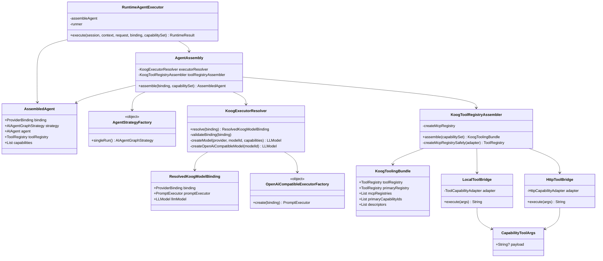

### 文件与逻辑

#### `RuntimeAgentExecutor.kt`

- `RuntimeAgentExecutor`
  - runtime agent.run 请求到真实 Koog agent 执行的翻译层。
  - 默认 `assembleAgent` 调用 `AgentAssembly().assemble(binding, capabilitySet)`。
  - 默认 `runner` 调用 `assembled.agent.run(prompt)`。

- `execute(session, context, request, binding, capabilitySet)`
  - 先装配 agent：`assembleAgent(binding, capabilitySet)`。
  - 再执行 prompt：`runner(assembledAgent, request.prompt)`。
  - 成功时返回 `RuntimeSuccess`：
    - `agent.run.started`，payload 是 `context.requestId`。
    - `agent.run.completed`，payload 是 `session.id`。
    - `output` 是 Koog 返回文本。
  - 捕获 `IllegalArgumentException`，映射为 `RuntimeProviderResolutionFailure`。
  - 捕获 `IllegalStateException`，映射为 `RuntimeCapabilityBridgeFailure`。
  - 捕获其他 `Throwable`，映射为 `RuntimeAgentExecutionFailure`。

#### `AgentAssembly.kt`

- `AssembledAgent`
  - 保存当前阶段装配出的 Koog agent 以及仓库侧元数据。
  - 包含 binding、strategy、agent、toolRegistry、capabilities。

- `AgentAssembly`
  - 负责把 `ProviderBinding` 和 `CapabilitySet` 组装成真实 Koog agent。

- `assemble(binding, capabilitySet)`
  - 调用 `executorResolver.resolve(binding)` 得到 Koog prompt executor 和 `LLModel`。
  - 调用 `toolRegistryAssembler.assemble(capabilitySet)` 得到 Koog `ToolRegistry`。
  - 调用 `AgentStrategyFactory.singleRun()` 得到 Koog strategy。
  - 构造 Koog `AIAgent`：
    - `promptExecutor` 来自 provider binding 解析。
    - `strategy` 是 single-run。
    - `llmModel` 来自 provider binding 解析。
    - `systemPrompt` 固定为 `You are a helpful assistant.`。
    - `toolRegistry` 来自 capability bridge。
  - 返回 `AssembledAgent`。

#### `AgentStrategyFactory.kt`

- `AgentStrategyFactory`
  - 当前阶段 Koog strategy 工厂。

- `singleRun()`
  - 返回 Koog `singleRunStrategy()`。
  - 是当前 agent 执行链默认策略。

#### `KoogExecutorResolver.kt`

- `ResolvedKoogModelBinding`
  - `ProviderBinding` 解析到 Koog 后的结果。
  - 包含原 binding、`PromptExecutor`、`LLModel`。

- `KoogExecutorResolver`
  - 把仓库内 `ProviderBinding` 转成 Koog 可执行绑定。

- `resolve(binding)`
  - 先调用 `validateBinding(binding)`。
  - `OPENAI_COMPATIBLE`：
    - 调用 `OpenAiCompatibleExecutorFactory.create(binding)`。
    - 调用 `createOpenAiCompatibleModel(binding.modelId)`。
  - `ANTHROPIC_COMPATIBLE`：
    - 要求 `baseUrl == https://api.anthropic.com`。
    - 使用 Koog `simpleAnthropicExecutor(binding.apiKey)`。
    - 使用 `LLMProvider.Anthropic` 创建模型。
  - `GEMINI_COMPATIBLE`：
    - 要求 `baseUrl == https://generativelanguage.googleapis.com`。
    - 使用 Koog `simpleGoogleAIExecutor(binding.apiKey)`。
    - 使用 `LLMProvider.Google` 创建模型。

- `validateBinding(binding)`
  - 校验 `baseUrl`、`apiKey`、`modelId` 都非空。
  - 失败会抛 `IllegalArgumentException`，上层 `RuntimeAgentExecutor` 会映射为 provider failure。

- `createModel(provider, modelId, capabilities)`
  - 创建 Koog `LLModel`。
  - 默认能力包含 completion、tools、tool choice、temperature。

- `createOpenAiCompatibleModel(modelId)`
  - 基于 OpenAI provider 创建模型。
  - 额外加入 `LLMCapability.OpenAIEndpoint.Completions`，避免 Koog 原生 OpenAI 模型表推断失败。

#### `ProviderCompatiblePromptExecutorFactory.kt`

- `OpenAiCompatibleExecutorFactory`
  - 创建支持自定义 endpoint 的 OpenAI-compatible executor。

- `create(binding)`
  - 用 `binding.apiKey` 和 `OpenAIClientSettings(baseUrl = binding.baseUrl)` 创建 `OpenAILLMClient`。
  - 返回 `SingleLLMPromptExecutor(client)`。

#### `KoogToolRegistryAssembler.kt`

- `KoogToolingBundle`
  - Koog registry 桥接结果。
  - `toolRegistry` 是最终合并后的 registry。
  - `primaryRegistry` 包含 local tool 和 HTTP tool。
  - `mcpRegistries` 来自 MCP transport。
  - `primaryCapabilityIds` 是 tool/http 的能力 id。
  - `descriptors` 是完整 capability 描述列表。

- `KoogToolRegistryAssembler`
  - 把 `CapabilitySet` 组装成 Koog 可消费的 registry bundle。
  - 默认 `createMcpRegistry` 支持 stdio。
  - 对 `StreamableHttp` 会明确失败，因为 Koog 0.8.0 还没有暴露真正的 streamable HTTP transport。

- `assemble(capabilitySet)`
  - 从 `capabilitySet.toolAdapters()` 和 `capabilitySet.httpAdapters()` 收集 primary ids。
  - 构造 `primaryRegistry`：
    - tool adapter 包装成 `LocalToolBridge`。
    - HTTP adapter 包装成 `HttpToolBridge`。
  - 对每个 MCP adapter 调用 `createMcpRegistrySafely(adapter)`。
  - 把 `primaryRegistry` 和所有 MCP registry 合并成最终 `toolRegistry`。
  - 返回 `KoogToolingBundle`。

- `createMcpRegistrySafely(adapter)`
  - 调用 `createMcpRegistry(adapter.transport)`。
  - 任意异常会包装成 `IllegalStateException`。
  - 上层 `RuntimeAgentExecutor` 会把它映射为 capability bridge failure。

- `CapabilityToolArgs`
  - Koog tool/http bridge 共用的最小字符串参数。
  - 目前只有可选 `payload`。

- `LocalToolBridge`
  - 把 `ToolCapabilityAdapter` 包装成 Koog `SimpleTool`。

- `LocalToolBridge.execute(args)`
  - 把 Koog tool 参数转换成 `RuntimeCapabilityRequest`。
  - 调用 `adapter.execute(request)`。
  - 调用 `toKoogText()` 把 `RuntimeResult` 压成字符串。

- `HttpToolBridge`
  - 把 `HttpCapabilityAdapter` 包装成 Koog `SimpleTool`。

- `HttpToolBridge.execute(args)`
  - 和 `LocalToolBridge.execute()` 类似，但目标 adapter 是 HTTP capability。

- `RuntimeResult.toKoogText()`
  - `RuntimeSuccess`：
    - 有 `output` 时返回 `output.toString()`。
    - 否则把事件 message 用换行连接。
  - 非成功结果直接返回 `toString()`。

## server 包

包路径：`src/main/kotlin/com/agent/server`

### UML

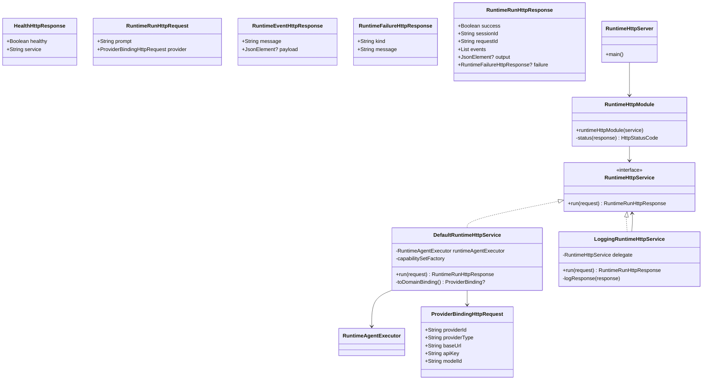

### 文件与逻辑

#### `RuntimeHttpContract.kt`

- `HealthHttpResponse`
  - `/health` 的响应体。
  - 只表示 HTTP 进程可响应，不代表 provider 或 runtime 可用。

- `ProviderBindingHttpRequest`
  - HTTP 请求中的 provider binding 视图。
  - `providerType` 是字符串，后续需要转成 `ProviderType`。

- `RuntimeRunHttpRequest`
  - `/runtime/run` 请求体。
  - 包含 prompt 和 provider binding。

- `RuntimeEventHttpResponse`
  - runtime event 的 HTTP 视图。

- `RuntimeFailureHttpResponse`
  - runtime failure 的 HTTP 视图。
  - `kind` 是压平后的错误类型。

- `RuntimeRunHttpResponse`
  - `/runtime/run` 的结构化响应。
  - 成功时包含 events/output。
  - 失败时包含 events/failure。

- `RuntimeHttpService`
  - HTTP 宿主暴露给路由层的 runtime 执行服务契约。

- `RuntimeHttpService.run(request)`
  - 执行一次 HTTP runtime 请求并返回结构化结果。

#### `RuntimeHttpService.kt`

- `DefaultRuntimeHttpService`
  - 把 HTTP 请求翻译到现有 runtime agent 执行链。
  - 默认持有 `RuntimeAgentExecutor()`。
  - 默认 `capabilitySetFactory` 返回空 `CapabilitySet`。

- `run(request)`
  - 生成新的 `sessionId` 和 `requestId`。
  - 调用 `request.provider.toDomainBinding()`。
  - providerType 不支持时返回失败响应：
    - `success = false`
    - `failure.kind = provider`
    - `message = Unsupported provider type ...`
  - provider 可转换时，调用 `runtimeAgentExecutor.execute()`：
    - `RuntimeSession(id = sessionId)`
    - `RuntimeRequestContext(sessionId, requestId)`
    - `RuntimeAgentRunRequest(prompt = request.prompt)`
    - `ProviderBinding`
    - `capabilitySetFactory()`
  - `RuntimeSuccess` 映射为成功 HTTP response。
  - `RuntimeFailed` 映射为失败 HTTP response。

- `ProviderBindingHttpRequest.toDomainBinding()`
  - 使用 `ProviderType.valueOf(providerType)` 转 enum。
  - 转换失败返回 null。
  - 转换成功返回 `ProviderBinding`。

- `RuntimeFailure.toFailureKind()`
  - `RuntimeProviderResolutionFailure` -> `provider`。
  - `RuntimeCapabilityBridgeFailure` -> `capability`。
  - `RuntimeAgentExecutionFailure` -> `agent`。
  - 其他 -> `runtime`。

#### `LoggingRuntimeHttpService.kt`

- `LoggingRuntimeHttpService`
  - 装饰器，不改变被包装服务语义。
  - 持有一个 `RuntimeHttpService delegate`。

- `run(request)`
  - 记录 runtime 请求进入日志。
  - 不输出 apiKey 或 prompt 原文，只记录 prompt 长度。
  - 调用 `delegate.run(request)`。
  - 正常返回时调用 `logResponse(response)`。
  - 异常时记录错误日志并重新抛出。

- `logResponse(response)`
  - 成功时记录 sessionId、requestId、eventCount。
  - 失败时记录 sessionId、requestId、failureKind、message。

#### `RuntimeHttpModule.kt`

- `runtimeHttpModule(service)`
  - Ktor `Application` 扩展函数。
  - 默认 service 是 `LoggingRuntimeHttpService(DefaultRuntimeHttpService())`。
  - 安装 JSON content negotiation：
    - `ignoreUnknownKeys = true`
    - `prettyPrint = true`
  - 注册两个路由：
    - `GET /health`
    - `POST /runtime/run`

- `GET /health`
  - 记录存活检查日志。
  - 返回 `HealthHttpResponse(healthy = true, service = "mulehang-agent")`。

- `POST /runtime/run`
  - 读取 `RuntimeRunHttpRequest`。
  - 记录请求摘要日志。
  - 调用 `service.run(request)`。
  - 用 `response.status()` 计算 HTTP 状态码。
  - 返回状态码和 response。

- `RuntimeRunHttpResponse.status()`
  - `success == true` 返回 `200 OK`。
  - `failure.kind == provider` 返回 `400 Bad Request`。
  - 其他失败返回 `500 Internal Server Error`。

#### `RuntimeHttpServer.kt`

- `main()`
  - 使用 Ktor CIO 启动 embedded server。
  - host 是 `127.0.0.1`。
  - port 是 `8080`。
  - module 是 `Application::runtimeHttpModule`。

## utils 包

包路径：`src/main/kotlin/com/agent/utils`

### UML

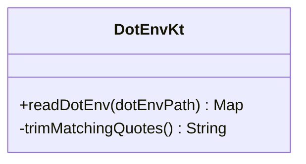

### 文件与逻辑

#### `DotEnv.kt`

- `readDotEnv(dotEnvPath)`
  - 默认读取 `.env`。
  - 文件不存在时返回空 map。
  - 读取规则：
    - 去掉行首尾空白。
    - 忽略空行。
    - 忽略 `#` 开头的注释行。
    - 支持 `export KEY=VALUE`。
    - 只处理包含一个 `=` 且 key 非空的行。
    - key 会 trim。
    - value 会 trim，并调用 `trimMatchingQuotes()` 去掉两侧匹配引号。
  - 当前 main 源码中没有其他文件直接调用它。

- `String.trimMatchingQuotes()`
  - 私有扩展函数，只服务于 `readDotEnv()`。
  - 如果值两侧都是双引号，返回中间内容。
  - 如果值两侧都是单引号，返回中间内容。
  - 其他情况返回原字符串。

## 关键执行链细化

### HTTP 到 Koog agent

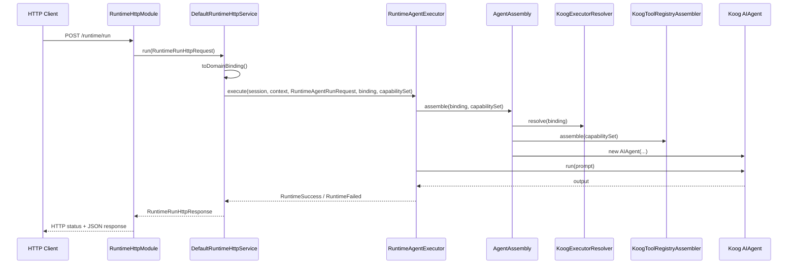

### runtime 路由到 agent executor

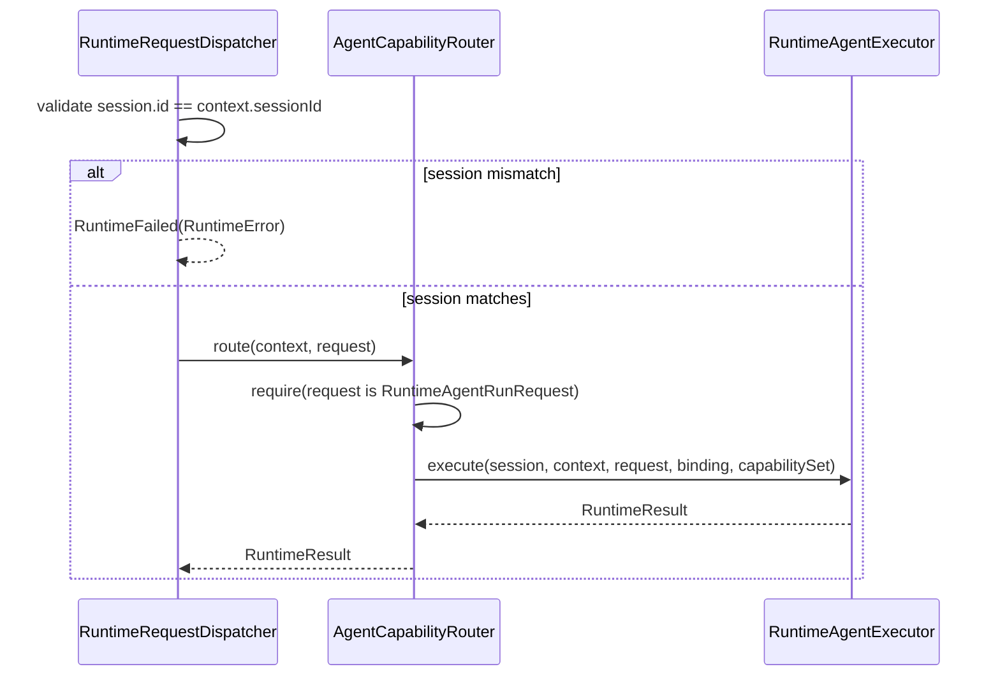

### provider 解析到 binding

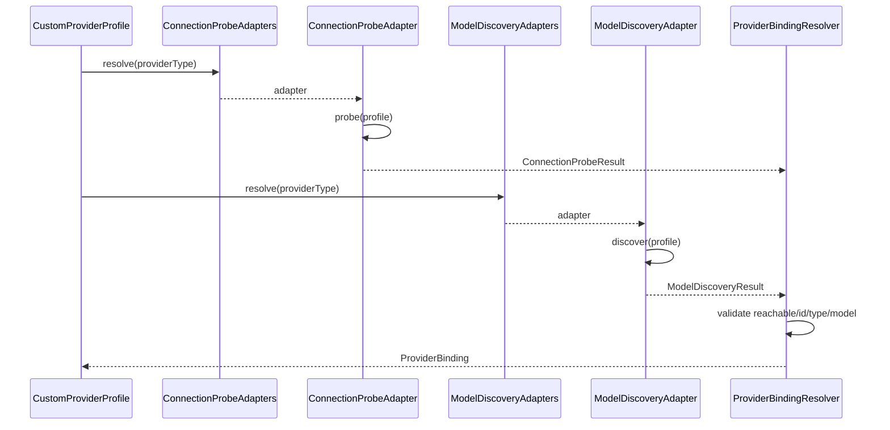

### capability 到 Koog tools

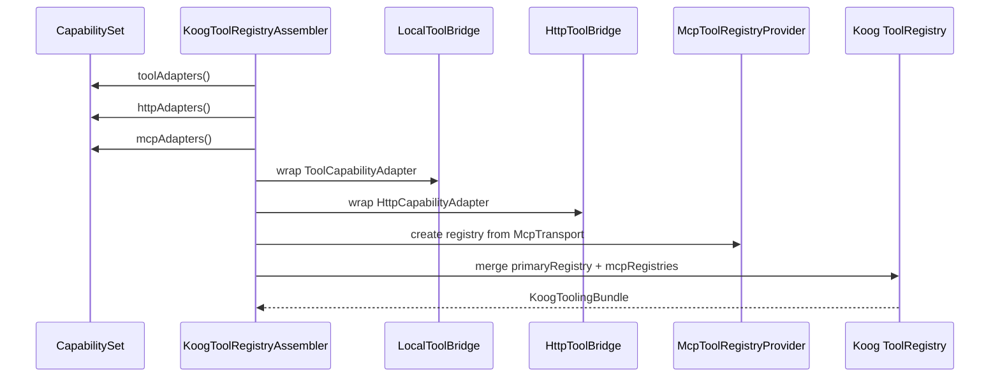

## 当前设计上的几个注意点

- `server` 当前直接调用 `RuntimeAgentExecutor`，没有经过 `RuntimeRequestDispatcher` 和 `AgentCapabilityRouter`。
- `provider` 包定义了 profile/probe/discovery/resolver 流程，但 HTTP 请求当前直接传入 binding 字段，没有走完整 provider 探测和模型发现流程。
- `capability` 包已经抽象出 tool/MCP/HTTP 三类 adapter，但 `DefaultRuntimeHttpService` 默认使用空 `CapabilitySet`。
- `KoogExecutorResolver` 对 OpenAI-compatible 支持自定义 baseUrl；Anthropic/Gemini 当前只允许默认 baseUrl。
- `RuntimeAgentExecutor` 的异常映射依赖异常类型：参数/校验问题进入 provider failure，状态/桥接问题进入 capability failure，其他进入 agent failure。
