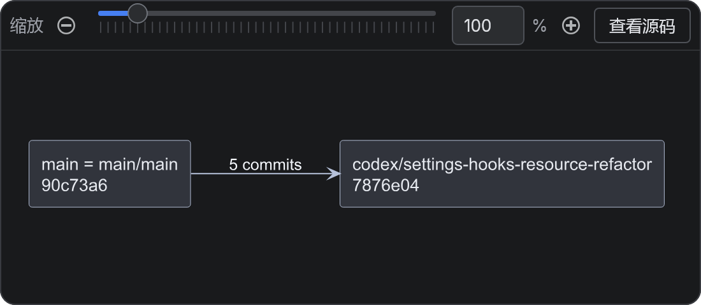

# 普通矩形节点配色遗漏修复

用户新日志使用 rectangle 绘制分支关系。前次主题只补齐 component 等类型，没有覆盖 rectangle 的独立配色参数，因此浅色文字仍落在默认浅色节点上；前次“原组件图通过”不能代表普通矩形也通过。

本次先用新日志原图添加失败回归，再补齐 16 类部署/结构节点的明暗背景、边框和文字颜色。每类节点分别渲染验证，保留用户显式主题及颜色的优先级。未改动用户正在编辑的 Hook 设置文件。

验证：部署配色、原 PlantUML 回归、全部 desktopApp 测试及桌面编译通过；IDEA 检查无错误。真实 Compose/Skia 离屏截图已经目视确认。运行中的旧应用需要加载新构建，已有渲染结果需重新生成。

配色规则参考 [PlantUML 部署图文档](https://plantuml.com/en/deployment-diagram)。

