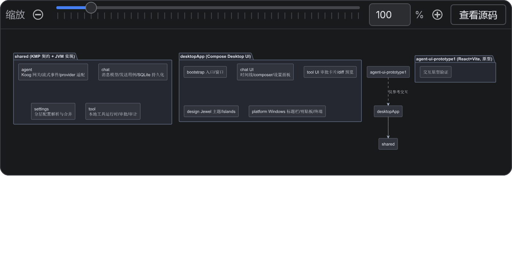
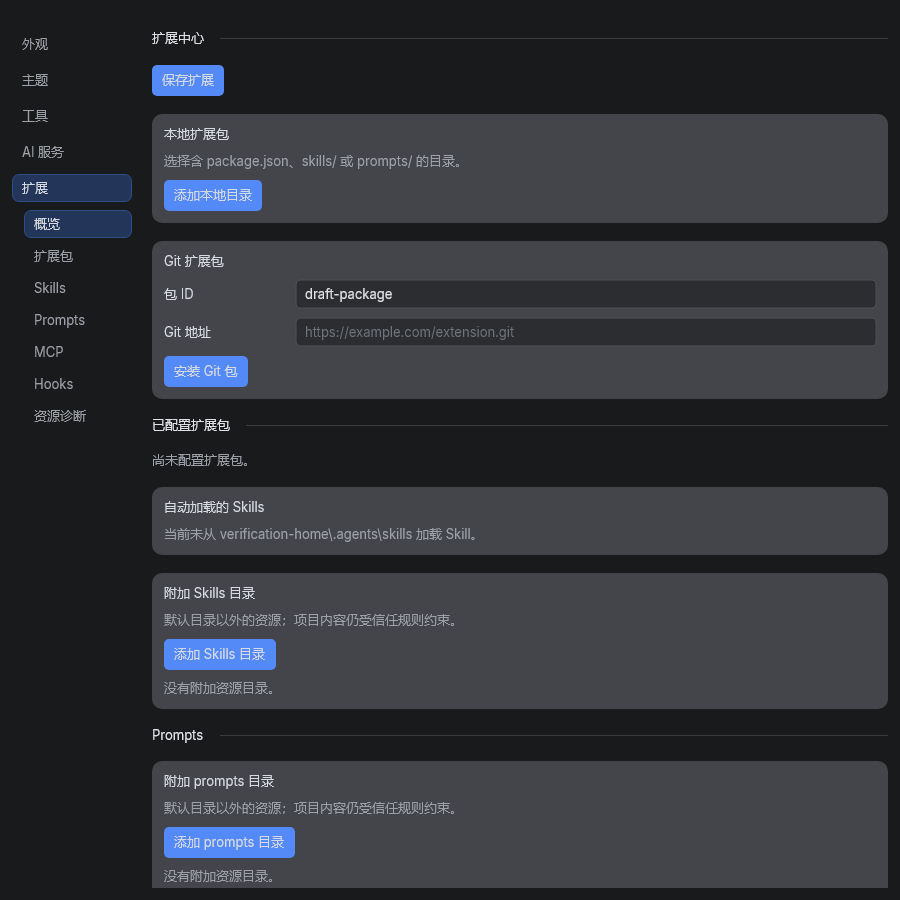
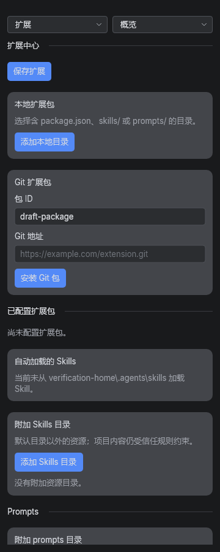
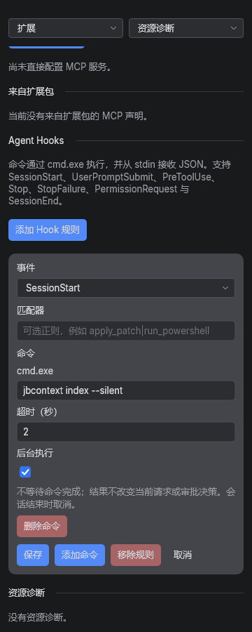

# 渲染、等待提示与设置导航实施记录

日期：2026-09-19

## 实施结果

- PlantUML 自动主题补齐组件、package、类图和时序图的明暗颜色；用户的 `!theme` 保持原样，显式 `skinparam` 可覆盖默认值。中文轮廓化保留原有文字颜色。
- 图表 100% 按当前视口适配。全局界面密度已经进入视口尺寸，渲染时不再重复乘全局倍率。
- 发送先追加用户消息、清空草稿并进入可取消状态，再在后台读取资源。超过 300ms 的资源准备、MCP、启动 Hook、消息 Hook 和模型等待会显示阶段提示。
- 新增同一 trace 下的资源准备、MCP、Hook、模型请求及首帧日志。逐条 Hook 记录顺序编号、同步/后台、结果和耗时，不把正文或凭据写入计时日志。
- 同步 Hook 仍按配置顺序等待并参与决策；后台 Hook 的输出不改变当前请求。后台任务归会话所有，跨轮次与配置更新保留，删除会话和应用退出时清理。
- 进程取消与超时会回收已观察到的后代；输出管道回收增加时间上限，避免取消后无限等待 EOF。
- 扩展页保留连续内容，增加概览、扩展包、Skills、Prompts、MCP、Hooks、资源诊断七个锚点。宽屏为缩进子菜单，低于 600dp 为顶部分类与锚点选择器。
- 锚点取实际布局坐标；重排后按段落与段落内偏移恢复阅读位置。鼠标使用 180ms 可中断滚动，键盘和减少动画模式直接跳转。
- 宽窄布局共享同一内容子树；真实 Git 输入框的草稿通过语义输入动作验证保留。窄屏表单纵向排列，Hook 操作按钮可换行。
- 拆分扩展页的卡片与配置变换、Hook 协议与 Windows 执行器、Koog 请求策略；聊天状态测试按工作区、交互、附件、配置、标题等主题拆分。

分区保存、配置范围和项目资源信任边界保留。未新增依赖，未修改同级参考项目。

## 根因与运行证据

### PlantUML

原始日志包含完整的 `@startuml … @enduml` 组件图，使用 `componentStyle rectangle`，没有显式主题。旧自动主题设置了浅色文字，却没有覆盖组件的默认浅色背景。原图回归测试在修复前失败于“组件必须使用暗色背景”，修复后通过。

IDEA 调试通过 MCP 启动测试配置，在 `PlantUmlRenderer.kt` 返回 SVG 前暂停。活动图运行值为 `isDark=true`、暗色填充存在、默认浅色填充不存在。随后以 `source.contains("componentStyle")` 条件断点命中原始组件图。组件图的颜色与轮廓化结果另由回归断言和真实 Compose 截图验证。调试未启动桌面应用或真实模型请求。

### 发送等待

历史记录中，从发送记录到 DeepSeek 请求记录约为 10.713 秒；旧日志没有资源、MCP、Hook 的分段数据，无法把这段时间全部归因于同步 Hook。

代码确认原发送路径在呈现用户消息前读取资源；MCP 工具准备也位于模型调用之前。本次保留完整工具准备和连接复用，只把资源读取移出 UI 线程，并补充阶段观测。

本地目标 jbcontext 索引 Hook 已改为后台执行，移除命令内部的 `start /b` 包装，保留原 2 秒超时。用户配置在修改前另存备份，不加入仓库。该超时现在约束实际索引任务；是否足够完成索引，需要看后续真实执行结果。

### 清理

完整测试中曾观察到取消命令后卡在 `DesktopProcessRunner.awaitOutput`，线程栈显示等待输出读取任务。修复增加执行前取消检查、后代追踪与有界管道回收；已补充真实 cmd/ping 后代取消测试。

## Hooks 参考设计

参考本地 DeepSeek Harness、Kilo 和 Pi 的既有设计：顺序执行保留输入变换与阻断语义，后台执行有明确的生命周期所有权；Pi 的部分能力来自扩展，不将扩展框架移植进本项目。继续使用现有配置协议，不修改参考项目。

## 验证

- JBR 25 下运行 `:shared:jvmTest :desktopApp:test :desktopApp:compileKotlin`，构建成功；shared 230 项、desktopApp 478 项测试通过，无失败或跳过。
- 测试覆盖：原始组件图、活动图、类图、时序图、中文、显式主题/颜色；100/150/200% 界面倍率；同步阻断、后台输出隔离、取消、超时、清理与会话启动去重；300ms 提示边界。
- 真实 Compose/Jewel 离屏渲染验证 360、480、599、600、900dp，检查实际 Git 草稿跨布局保留，并生成 Hook 编辑器截图。
- IDEA 对渲染、导航、设置装配、发送状态、Hook 协议/执行器、Koog 与进程运行器等受影响生产文件进行问题检查。
- 没有执行真实远程模型的延迟对比，也没有把离屏截图冒充完整桌面窗口的交互录屏。

## 耗时对照

以下是本机单次受控测量，不是性能承诺，也不代表 jbcontext 或远程模型的实际耗时。毫秒整数中的 0 表示不足 1ms。

| 场景 | 准备/调度耗时 |
| --- | ---: |
| 关闭 Hook | 2ms |
| 同步 Hook，测试命令固定等待 250ms | 258ms |
| 后台 Hook，同一测试命令 | <1ms |
| 本机 stdio MCP 首次连接与工具发现 | 568ms |
| 相同 MCP 配置复用连接 | <1ms |

MCP 对照中初始化和工具发现各执行一次，复用没有跳过首次准备。测试可重新运行，最新测量写入模块的 `build/verification/`。

## 截图

截图来自实际生产 Composable，使用合成配置；未加载用户凭据。设置图展示扩展内容与导航区域。

## 交付边界

用户已将实施代码分组提交到当前分支。本记录及截图作为后续验证交付，不代替用户创建提交。真实模型首帧的主要耗时来源仍需由下一次实际请求的新增阶段日志确认。
