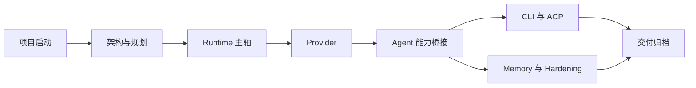
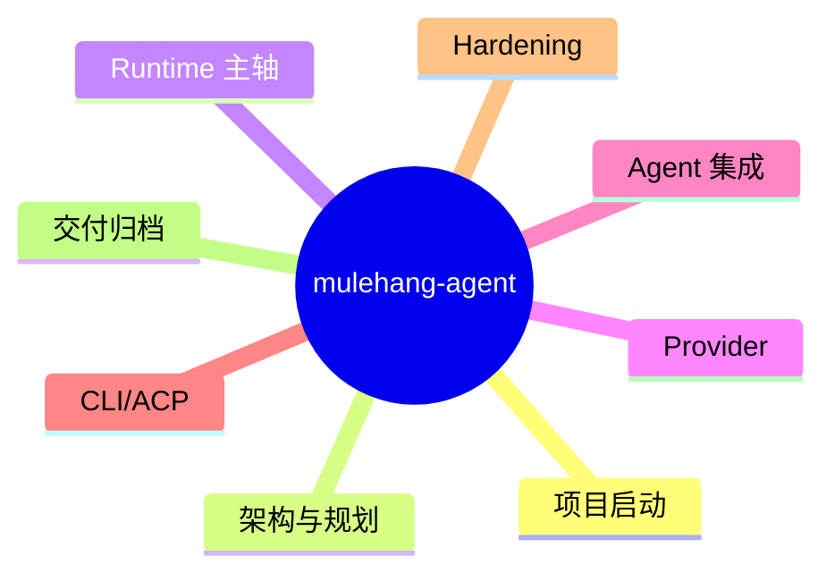
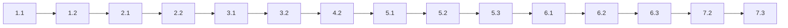
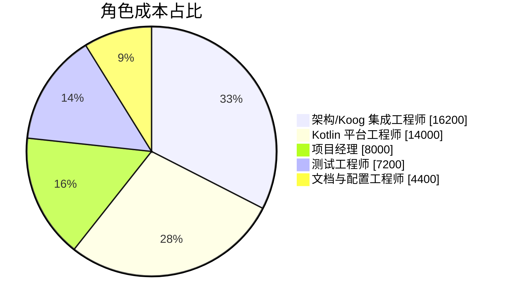
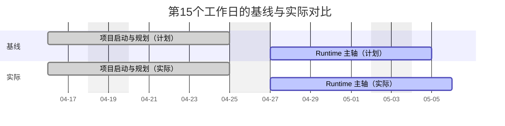

# 软件项目管理实验报告2（模板版）

| 字段 | 内容 | 字段 | 内容 |
| --- | --- | --- | --- |
| 实验名称 | 采用project完成进度计划（基于 `mulehang-agent` 项目） | 实验序号 | 2 |
| 姓名 | 待填写 | 系院专业 | 软件工程 |
| 班级 | 待填写 | 学号 | 待填写 |
| 实验类型 | 综合型 | 实验日期 | 待填写 |
| 指导教师 | 雷光波 | 成绩 | 待填写 |

## 一、实验目的

1. 理解 WBS、任务依赖、关键路径、资源分配与基线管理等软件项目进度计划核心概念。
2. 以当前 `mulehang-agent` 仓库为对象完成进度计划分析，而不是照搬指导书中的示例项目。
3. 在不强制依赖 Microsoft Project 的前提下，用 Mermaid、表格和文字完成计划表达。
4. 输出一份能够支撑课程实验要求的项目进度计划报告。

## 二、实验内容与要求

1. 根据仓库文档和目录结构，完成项目范围确认与阶段划分。
2. 建立 WBS，给出各任务工期、前置关系和关键路径分析。
3. 完成角色分配、成本估算、基线对比和偏差分析。
4. 图示优先使用 Mermaid；DOCX 中无法直接渲染时保留 Mermaid 源码。
5. 本次实验重点是学习项目管理基本概念，不要求必须使用 Microsoft Project。

## 三、实验设备

1. 地点：本地个人开发环境
2. 操作系统：Windows 11
3. 开发工具：IntelliJ IDEA、Gradle、Kotlin/JVM
4. 文档工具：Markdown、Mermaid、DOCX 自动生成脚本

## 四、实验步骤

### 1. 项目范围确认与阶段拆分

以 `mulehang-agent` 为实验对象，确认项目主线为 `Runtime -> Provider -> Agent -> CLI/ACP -> Hardening`。

项目计划开始日期修正为 `2026-04-16`，在 50 个工作日约束下，确定实验版计划总工期为 38 个工作日，计划完成日期为 `2026-06-08`，并保留 12 个工作日缓冲。

对应的前两项计划如下：

1. `1.1 项目章程与范围确认`：安排在 `2026-04-16`，工期 1 个工作日。主要输出项目目标、范围边界、50 个工作日约束、阶段划分原则和交付物定义。
2. `1.2 仓库现状调研与风险识别`：安排在 `2026-04-17`，工期 1 个工作日。主要阅读 `README.md`、总设计文档、总实施计划和阶段文档，识别 Runtime、Provider、Koog 集成、CLI/ACP 和 Hardening 的主要风险点。

图示（Mermaid）：

### 2. WBS 分解与任务估算

将项目拆分为启动、架构、Runtime、Provider、Agent、CLI/扩展、Hardening 与收尾等阶段。

为关键任务设置工期，例如 `Runtime contracts` 4 天、`Probe/Discovery/Binding` 4 天、`Capability 桥接` 4 天。

图示（Mermaid）：

### 3. 任务依赖与关键路径分析

建立前置关系后，关键路径为：

`1.1 -> 1.2 -> 2.1 -> 2.2 -> 3.1 -> 3.2 -> 4.2 -> 5.1 -> 5.2 -> 5.3 -> 6.1 -> 6.2 -> 6.3 -> 7.2 -> 7.3`

各节点具体工作内容如下：

1. `1.1 项目章程与范围确认`：明确项目目标、范围边界、总工期约束、阶段划分方式和实验交付物。
2. `1.2 仓库现状调研与风险识别`：阅读仓库入口文档和阶段设计文档，识别 Runtime、Provider、Agent、CLI/ACP、Hardening 的主要风险。
3. `2.1 总体架构设计`：围绕 `runtime-first` 思路确定系统总体架构，明确 Runtime、Provider、Koog Agent 和 Client Surface 的边界。
4. `2.2 实施计划与阶段拆分`：把总体架构拆分成可执行阶段，形成可安排工期和前置关系的任务计划。
5. `3.1 Runtime contracts 定义`：定义 `session`、`request context`、`capability request`、`event/result/error` 等基础契约。
6. `3.2 Session / Event / Result 实现`：把 Runtime 主轴中的核心对象和调用流程落成代码骨架，形成统一请求流。
7. `4.2 Probe / Discovery / Binding`：实现 provider 的连接探测、模型发现和最终 binding 解析，是从 Runtime 进入模型执行的关键桥梁。
8. `5.1 Koog Executor 与 Model 解析`：把 `ProviderBinding` 解析为 Koog 可执行的 executor 与 model 组合。
9. `5.2 Capability 桥接`：把 local tool、MCP、direct HTTP 三类能力统一接到 Koog agent 的 capability 体系中。
10. `5.3 Agent 执行链与测试`：打通 `runtime -> agent.run(...) -> runtime result` 的真实执行链路，并补齐核心测试。
11. `6.1 CLI streaming 输出`：让 CLI 成为第一主入口，负责输入解析、流式输出、结构化结果展示和错误提示。
12. `6.2 ACP 协议桥接`：基于同一套 Runtime 和 Koog 主线增加 ACP 第二入口，完成 session 和事件映射。
13. `6.3 文档与配置样例收口`：整理 README、示例配置和阶段文档，保证交付物和使用方式一致。
14. `7.2 集成测试与缺陷修复`：在主线功能打通后进行集成级验证，修复跨阶段联动问题。
15. `7.3 交付归档`：完成实验版项目计划的最终归档，沉淀文档、配置、结果说明和可交付材料。

其中 `Probe/Discovery/Binding`、`Capability 桥接`、`Agent 执行链与测试` 是影响总工期的关键任务。

图示（Mermaid）：

### 4. 资源分配与成本估算

设置项目经理、架构/Koog 集成工程师、Kotlin 平台工程师、测试工程师、文档与配置工程师五类角色。

估算总投入为 68 人天，总成本约为 49800 元，其中架构/Koog 集成工程师成本最高。

图示（Mermaid）：

### 5. 基线设定与进度跟踪

以 `2026-04-16` 版本计划作为基线，假设在第 15 个工作日，即 `2026-05-06`，检查项目状态。

截至 `2026-05-06`，项目整体仅滞后约 1 个工作日，偏差主要来自 Runtime 与 Provider 边界确认耗时增加。

图示（Mermaid）：

## 五、实验结果与分析

1. 计划数据及结果分析：本次实验版计划自 `2026-04-16` 启动，计划于 `2026-06-08` 完成，总工期为 38 个工作日，低于 50 个工作日的练习约束；在合理并行安排下，当前仓库具备可执行性。
2. 实验中遇到的问题及解决办法：指导书案例项目与当前仓库不一致，因此保留实验方法论、替换项目背景；Mermaid 无法在 Word 中原生渲染，因此在 DOCX 中保留源码而不强行转图片。
3. 实验中尚未解决的问题及不足：个人信息、成绩、最终教师要求的截图样式仍需根据实际提交要求补充；若课程要求严格的软件界面截图，需后续再用项目管理工具补图。

## 六、实验成绩

待教师填写
